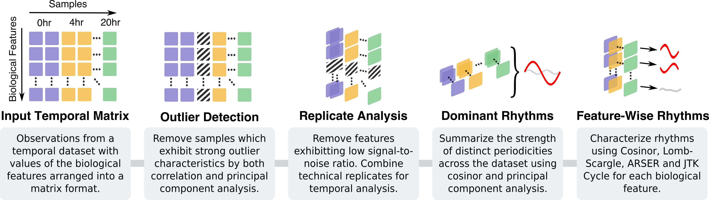

# DiscoRhythm - Discovering Rhythmicity 


[](https://doi.org/10.1093/bioinformatics/btz834)

## Overview

A summary of DiscoRhythm from *[Carlucci M. et al, 2019](https://doi.org/10.1093/bioinformatics/btz834)* is presented below.



> DiscoRhythm is available as a web application or an R/Bioconductor package for estimating phase, amplitude, and statistical significance using four popular approaches to rhythm detection (Cosinor, JTK Cycle, ARSER, and Lomb-Scargle). [...] Informative visualizations, interactive modules for quality control, dimensionality reduction, periodicity profiling, and incorporation of experimental replicates make DiscoRhythm a thorough toolkit for analyzing rhythmicity.

-----------------------------------------------------

## Getting Started

The web application can be accessed on the [DiscoRhythm public server](https://mcarlucci.shinyapps.io/discorhythm/).

See the [tutorial](https://bioconductor.org/packages/release/bioc/vignettes/DiscoRhythm/inst/doc/disco_workflow_vignette.html) for details on usage of the web application and R package.

See [DiscoRhythm on Bioconductor](https://bioconductor.org/packages/release/bioc/html/DiscoRhythm.html) for more details.

Use the [issue board](https://github.com/matthewcarlucci/DiscoRhythm/issues) to provide feedback on DiscoRhythm (feature requests, bugs, and further questions).

### R Package Installation

For local usage of DiscoRhythm, install the R package from Bioconductor:

```
if (!requireNamespace("BiocManager", quietly=TRUE))
    install.packages("BiocManager")
BiocManager::install("DiscoRhythm")
```

Or install the latest version from GitHub:

```
library(devtools)
install_github("matthewcarlucci/DiscoRhythm", build_vignettes=TRUE)
```

### Usage with Docker

If [docker](https://docs.docker.com/install/) is installed, the 
[DiscoRhythm container on Docker Hub](https://hub.docker.com/r/mcarlucci/discorhythm) 
can be used to run the DiscoRhythm web application. 

### Citation

>Matthew Carlucci, Algimantas Kriščiūnas, Haohan Li, Povilas Gibas, Karolis Koncevičius, Art Petronis, Gabriel Oh, DiscoRhythm: an easy-to-use web application and R package for discovering rhythmicity, Bioinformatics, , btz834, [https://doi.org/10.1093/bioinformatics/btz834](https://doi.org/10.1093/bioinformatics/btz834)
