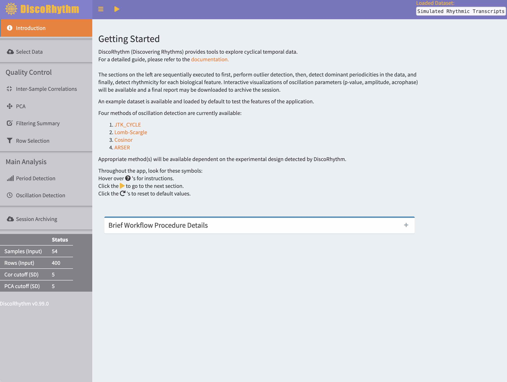
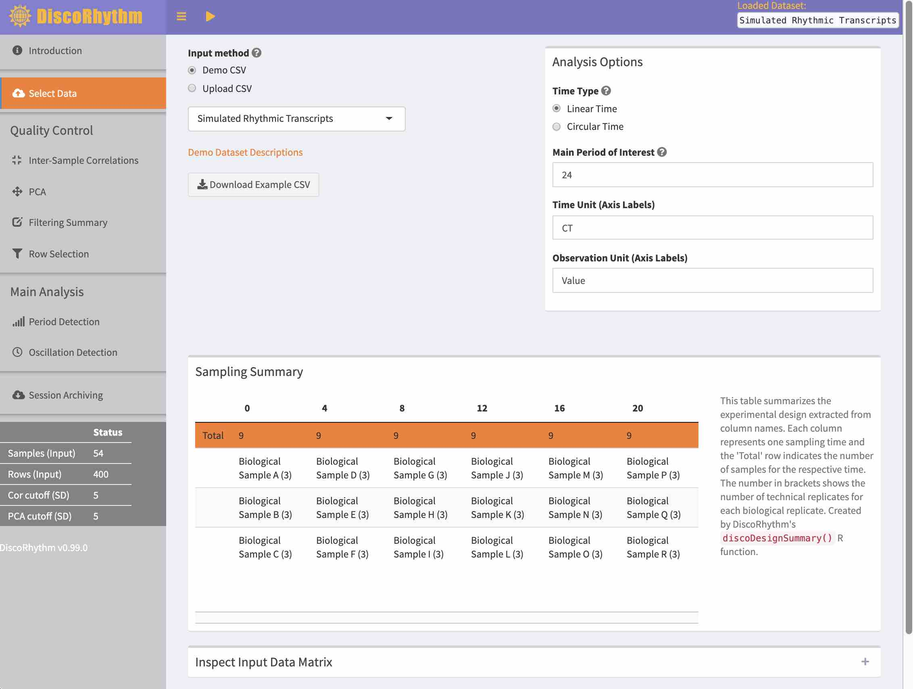
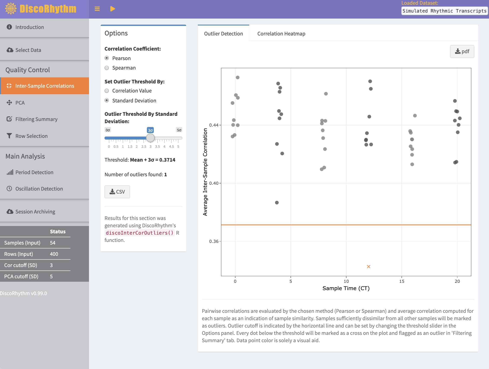
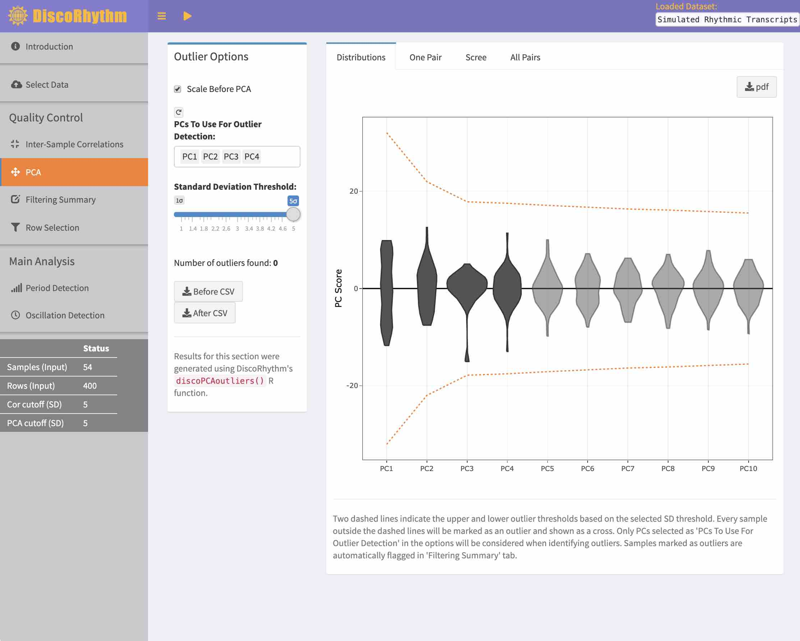
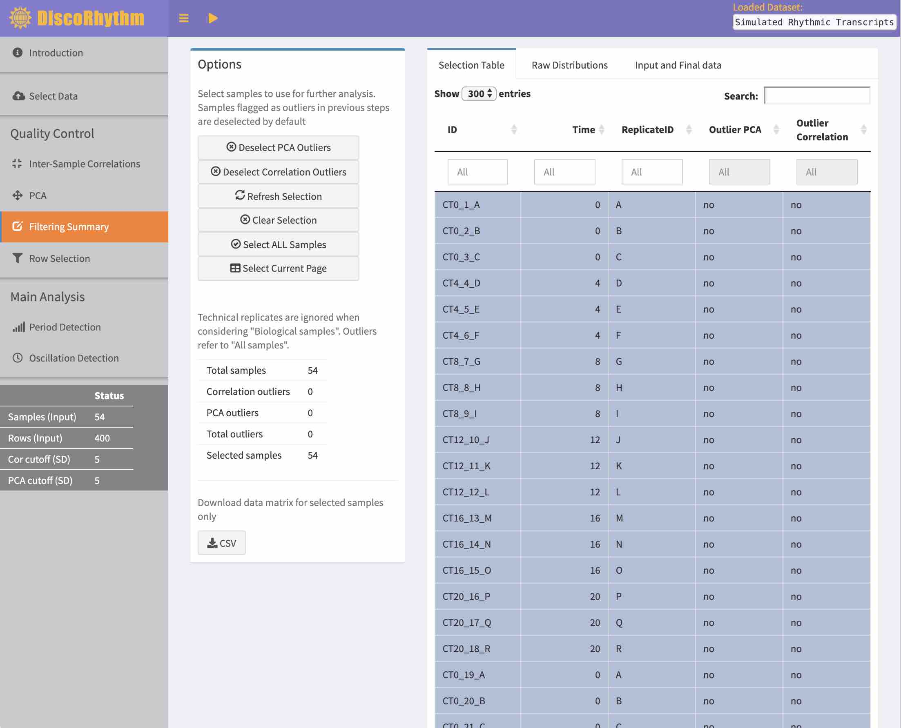
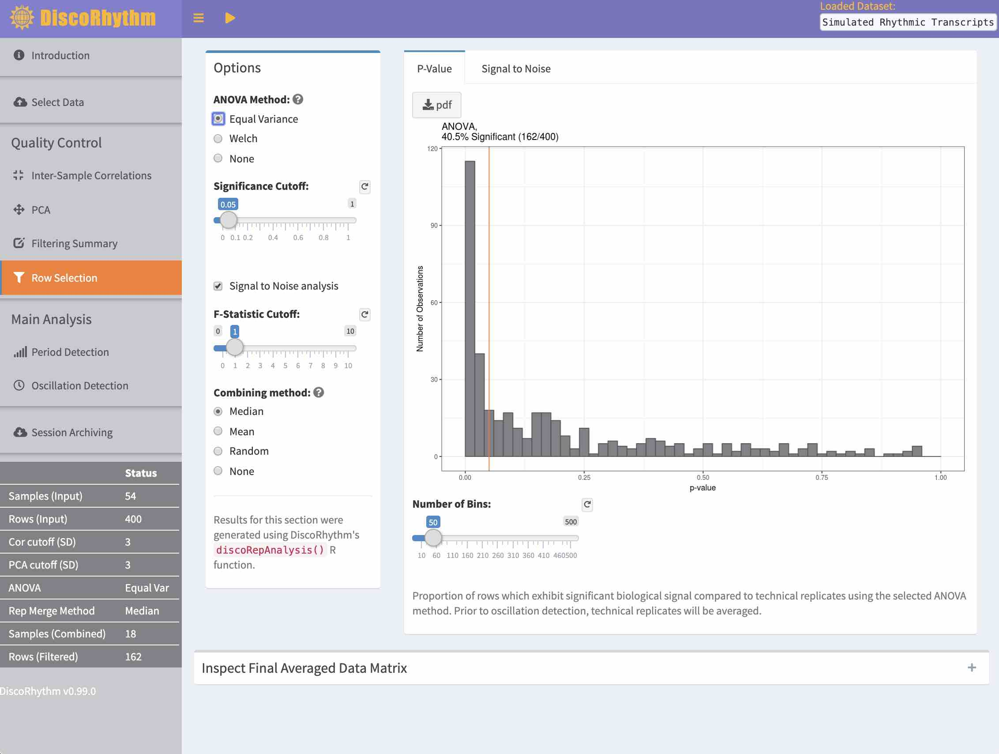
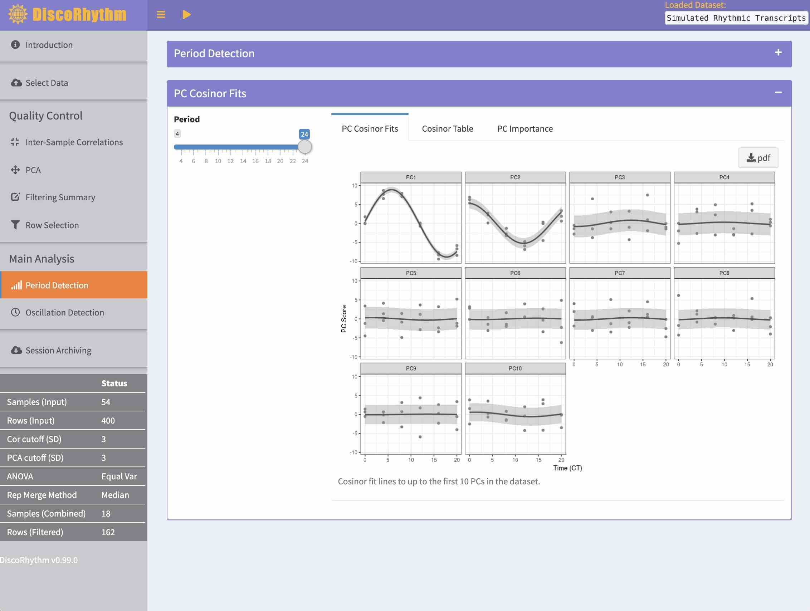
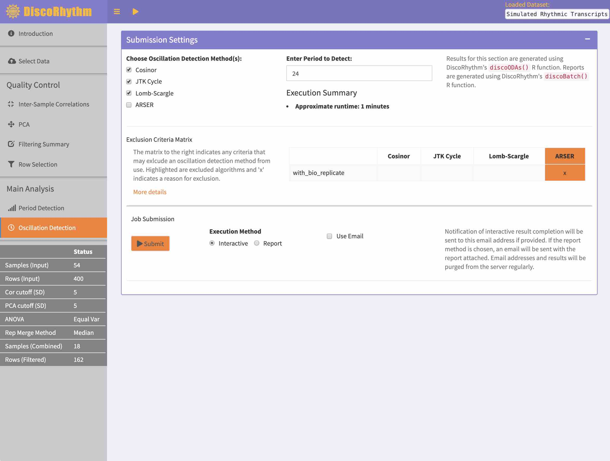
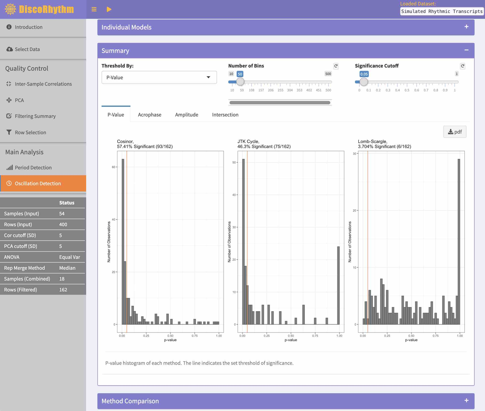
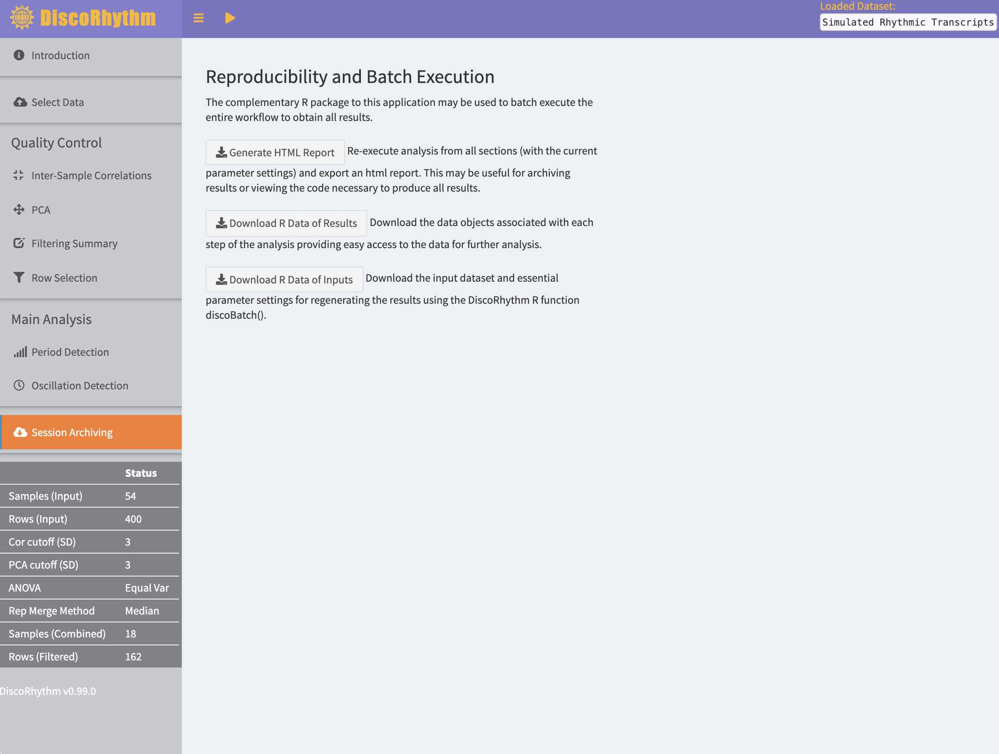

# Getting Started

## Accessing the Graphical User Interface

The public server for DiscoRhythm is available 
[here](https://disco.camh.ca)[^1].

[^1]: Users will be timed out of this server
after a session is idle for 30 minutes
after the last computation has completed.

The web application currently has no auto-save functionality, **results will be
lost upon session termination.** It may be helpful to use the batch execution
feature (see \@ref(session-archiving)) which automatically downloads results
upon completion.

To start using DiscoRhythm directly from the web application proceed to
\@ref(discorhythm-interface-walkthrough).

## Local Installation

To run the application locally or use DiscoRhythm with R, the DiscoRhythm R
package and its dependencies [^dependencies] must be installed by executing the
following
commands in R:

[^dependencies]: Installation of [pandoc](https://pandoc.org/installing.html)
is required in order to use the report
generation features of DiscoRhythm.

```
if (!requireNamespace("BiocManager", quietly=TRUE))
    install.packages("BiocManager")
BiocManager::install("DiscoRhythm")
```

The following commands then can be used in order to launch the DiscoRhythm application:

```
library(DiscoRhythm)
discoApp()
```

For improved performance DiscoRhythm can be parallelized using multiple cores:

```
discoApp(ncores=number_of_available_cores)
```

### Run the Web Application with Docker (Optional)

Alternatively, if [docker](https://docs.docker.com/install/) is installed, the
[DiscoRhythm container on Docker Hub](https://hub.docker.com/r/mcarlucci/discorhythm)
can be pulled and used to run the web application locally [^locally]
avoiding the need to install DiscoRhythm and its dependencies

[^locally]: See instructions on Docker Hub.

## Using DiscoRhythm from R

The same computations performed in the web application can be executed directly
in R. This may help with:

- Analyzing large datasets
- Executing the workflow conveniently on multiple datasets
- Including additional R code to customize the workflow

Section \@ref(discorhythm-r-usage) describes using DiscoRhythm from R in more
detail.

# Introduction

DiscoRhythm is a framework for analyzing periodicity of large scale temporal
biological datasets (e.g. circadian transcriptomic experiments).
The main goal of this package is to characterize the rhythmicity present in the
provided dataset by performing the following steps:

1. Import and clean-up
2. Outlier detection
3. Principal component analysis
4. Analysis of experimental replicates
5. Detection of dominant rhythmicities
6. Detection of feature-wise oscillation characteristics [^characteristics]

[^characteristics]: Estimating cyclical characteristics such as: period, phase,
amplitude, and statistical significance using four methods
(Cosinor, JTK Cycle, ARSER, and Lomb-Scargle).

The entire workflow can be run interactively in the web application or run
directly in R.

Section \@ref(input-format) specifies the data input format expected by the
DiscoRhythm app.

Next, section \@ref(discorhythm-interface-walkthrough) will describe all the
analysis steps and their purpose.
Section
\@ref(discorhythm-r-usage) will then demonstrate how to generate the same 
results using the DiscoRhythm R package directly from the R command line.

## Background

### Key Definitions for Rhythm Detection in Biological Time Series
**Sinusoid** - A mathematical curve that describes periodic oscillations
following a sine function.

**Period** - Parameter describing the duration after which a temporal pattern
repeats itself.

**Acrophase** - The time in a periodic cycle where a temporal pattern is at its
maximum value, typically referring to the peak of a sinusoid curve.

**Amplitude** - The amount of change in signal seen during the course of an
oscillation.

**P-value** - Described simply, it is the probability that a finding could have
occurred under the null hypothesis. For rhythm detection this would be the
probability that the “goodness of fit” of a rhythmic model would occur at a
value greater than or equal to the observed value when applied to a non-rhythmic signal.

**Biological replicates** - Independent random samples from the population of
interest with the same time of collection.

**Technical replicates** - A single biological sample split into multiple
samples which are processed independently are typically labelled as “technical
replicates” relative to one another and are useful for determining the variance
introduced simply by the process of sample collection and preprocessing.

### Real-world Example Datasets

DiscoRhythm was designed for large scale “-omic” data matrices such as those
found in the following studies:

@Krishnaiah2017-lm - circadian metabolomics study where data matrices from
supplemental table 2 may be used as input to DiscoRhythm after removing the
first row from each sheet and saving as CSV. The “Liver_data” sheet may be used
after the following modifications:

1. Remove row 2 (non-essential metadata)
2. Remove ‘Set[1-2]-’ from all column names (DiscoRhythm column name format)
3. Save as CSV

@Hurley2018-hg - A circadian proteomic study where supplemental dataset 2 may be
used as input to DiscoRhythm after saving sheet “2B” or “2H” as CSV.

@Wu2016-rd - This software package contains truncated transcriptomic datasets
that can be exported from R for use with DiscoRhythm including a simulated
dataset (object name cycSimu4h2d) containing various waveforms to test the
performance of the rhythm detection algorithms.

@Singer2019-lq - The `r BiocStyle::Githubpkg("hugheylab/simphony")` R package
can be used to generate complex simulated “-omic” datasets which can easily be
formatted for input to DiscoRhythm.

See section \@ref(input-format) for full details on input data format.

### Further Background References
For a more detailed background on statistical methods, experiment design, and
method selection see the following references:

@Cornelissen2014-sa - A detailed review of Cosinor based techniques for rhythm
analysis. The cosinor test as presented in Cornelissen et. al. (2014) is a
common hypothesis test which may appear in the literature as "Cosinor",
"harmonic regression", "sinusoid regression", and other similar names.

@Hughes2017-ik - Experiment design for circadian sequencing experiments.
Provides additional comments on p-values obtained from rhythm detection methods.

@Deckard2013-pm - Evaluates 4 methods (de Lichtenberg, Lomb-scargle, JTK Cycle,
and persistent homology) and Fig. 6 provides a clear decision tree to aid with
the selection of the most suitable method for practical data analysis.
This publication references additional method evaluation articles.

@Wu2014-mo provides an empirical evaluation of 5 methods (ARSER, JTK Cycle, COSOPT,
Fisher's G test, and HAYSTACK).

These references also provide some valuable insights about the experiment design
stage of rhythm detection.
(see section \@ref(algorithm-restrictions) for a few additional comments).

## Available Methods

The four currently implemented methods in DiscoRhythm are well established and
have sound statistical methodology. These methods were easily accessed or
implemented in R and fit well into the workflow for rhythmicity analysis.
Additional algorithms fitting this criteria may be added to DiscoRhythm in the
future. Below are some quotes taken directly from publications of these methods,
briefly describing the rationale for each:

### Cosinor

@Cornelissen2014-sa

>“Conceived as a regression problem, the
method is applicable to non-equidistant data, a major advantage.”

and referring to least squares techniques more generally:

>“useful in curve-fitting problems,
where it is desirable to obtain a functional form that best fits a given set of
measurements.”

### JTK Cycle

@Hughes2010-st

>“JTK_CYCLE’s increased resistance to outliers
results in considerably greater sensitivity and specificity”

### Lomb-Scargle

@Glynn2006-rv

>“Our approach should be applicable for
detection and quantification of periodic patterns in any unevenly spaced gene
expression time-series data.”

### ARSER

@Yang2010-os

>“ARSER was superior to two existing and widely-used
methods, COSOPT and Fisher's G-test, during identification of sinusoidal and
non-sinusoidal periodic patterns in short, noisy and non-stationary time-series”

# Input Format

Description of the input format expected by DiscoRhythm.

## Example Dataset

Below is a small simulated circadian transcriptomic dataset generated using
`r BiocStyle::Githubpkg("hugheylab/simphony")` which follows the expected input
format for DiscoRhythm. The dataset was generated to contain ~50% rhythmic
transcripts with many different phases of oscillation.

```{r echo=F}
suppressPackageStartupMessages({
  suppressWarnings({
    library(DiscoRhythm)
  })
})

indata <- discoGetSimu()
knitr::kable(head(indata[,1:6]),format = "markdown") # Inspect the data
```

## Row Names

The first column should contain unique feature IDs (e.g. gene names in this
case).

```{r echo=F}
kableExtra::column_spec(knitr::kable(head(indata[,1:6])),
              1, background = "#FDB813",
              include_thead = TRUE)
```

All subsequent columns contain experimental sample data.

```{r echo=F}
kableExtra::column_spec(knitr::kable(head(indata[,1:6])),
              2:6, background = "#FDB813",
              include_thead = TRUE)
```

## Column Names

Sample metadata is extracted from the column names of the matrix.

```{r echo=F}
kableExtra::column_spec(
kableExtra::row_spec(
  knitr::kable(head(indata[,1:6])),
              0, background = "#FDB813"),
1, background = "inherit",include_thead = TRUE)
```

Names [^alphanumeric] are expected to follow the pattern:

[^alphanumeric]: All fields should contain only alphanumeric values (with the
exception
of '.' in the `Time` field which is allowed for decimal values.

`Prefix` `Time`\*\_`Unique Id`\_`Replicate Id`

| Field          | Description                                                                       | Examples                                  |
|----------------|-----------------------------------------------------------------------------------|-------------------------------------------|
| `Prefix`       | A unit of time that will be used by the web application.                          |  `hr`, `ZT`, `CT`                         |
| `Time`\*       | Indicates the time of collection for the respective sample. Can only be positive. | `20`, `2.1`, `0.3`                        |
| `Unique Id`    | Used to uniquely identify samples in visualizations and summaries.                | `GSM3186429`, `sample1`, `subjectA`, `AX` |
| `Replicate Id` | Used to identify each biological sample uniquely when combined with `Time`.       | `1`, `A`, `rep1`                          |

Table: Descriptions of the naming convention used by DiscoRhythm.
\* *Mandatory field*

**Sample Time -** `Time` [^time] is the only mandatory field and the other 
fields 
are used to
specify the additional information about samples when necessary.

[^time]: `32`, `CT32`, `CT32_AS_1`, `32_AS_1` are all valid naming styles.

**Biological vs Technical Replicates -** `Time` + `Replicate Id` [^id] are used
to identify independent samples collected at the same timepoint (biological
replicates). Samples with the same `Time` and `Replicate Id`
are assumed to be technical replicates originating from a single biological
sample.

[^id]: If no `Replicate Id` is provided, all samples are assumed to be
independent biological replicates.

**Unique Sample Identity -** Each column name should be unique such that all
samples can be uniquely identified to the user. The `Unique Id` field is
intended for this purpose. If column
names are not unique, the `Unique Id` field will be generated to provide
unique sample names during usage of DiscoRhythm.

### Processed Metadata Table

The `Time` and `Replicate Id` data extracted from the column names 
will be seen throughout the DiscoRhythm application [^application] as:

[^application]: This table is the `colData(se)` data stored in R.

```{r echo=F,message=FALSE}
knitr::kable(head(SummarizedExperiment::colData(
  discoDFtoSE(indata)
)), format = "markdown")
```

--------------------------------------------------

*Note: If there is more relevant metadata in the experiment that does not fit
into the design specified in this section, it may 
be appropriate to split the 
dataset into several parts and use each subgroup as a separate input for
DiscoRhythm. Example: If the experiment includes multiple conditions, each
condition may be an independent input dataset for DiscoRhythm.*

## Circular and Linear Time

DiscoRhythm defines time within a dataset in one of two ways:

1) Linear time
2) Circular time

Linear time exists in systems where an experiment start time is meaningful
(often setting t=0 to some specific event). Circular time exists in experiments
where the start of experiment is not meaningful or left unobserved
(e.g. time-of-day in a cross-sectional study). For a specific dataset, one of
these
two types has to be selected and it will have an influence on how the
DiscoRhythm analysis will be performed.

Example of linear time in hours: `1,2,3 ... 24,25,26`  
Example of circular time, time-of-day in hours: `1,2,3 ... 24,1,2`

For example, circadian studies with mice often entrain to a 24hr light/dark
schedule and then release mice into total darkness in order to remove external
cues. The presence of a specific event 
(release into total darkness) would make the dataset suitable for the "Linear
time" setting of DiscoRhythm.

On the other hand, if samples were collected during the entrainment to the
light/dark base-cycle, "Circular time" would be appropriate as mice sampled at
the
same point in the cycle on different days may be treated as biological
replicates [@Hughes2017-ik].

# DiscoRhythm Interface Walkthrough

This section will walk the user through each section of the DiscoRhythm web
application. It is recommended to keep this documentation open during
the first use of the application in order to track what the application is doing
in each section.

## The Interface

The DiscoRhythm web interface is a dashboard where the sections of the
analysis progress in a sequential fashion with data from the previous step
being carried over to the next.
Each section can be accessed using the sidebar on the left.

Interactive controls allow users to set parameters specific to each section's analysis.
When parameters relevant to a figure change, the corresponding figure will
dynamically update to reflect the newly calculated results. The exception
to this is the oscillation detection section which requires user input to 
re-compute results.

Various download buttons are available throughout
the application for extracting plot outputs and numerical results.

```{r interface, echo=F, fig.cap="Screenshot of the initial DiscoRhythm landing page."}

```

## Select Data

**Purpose:** To upload, clean, and summarize the experimental design of the
provided dataset.

```{r echo=FALSE}
# Figure caption template
figcap="Screenshot of the '%s' section of the DiscoRhythm interface."

```

```{r selectData, echo=FALSE, fig.cap=sprintf(figcap,'Select Data')}

```

An input dataset is expected to be in comma separated value (CSV) format as
specified in section \@ref(input-format). Upload the dataset using the
"upload CSV" input method.

The simulated dataset (from section \@ref(example-dataset)) is available to
test the features of DiscoRhythm.

Messages or warnings may be seen at this point as DiscoRhythm imports
the dataset and performs a few clean-up tasks:

1. Rows with constant values will be removed
2. Rows with any number of missing values will be removed
3. Validity of column name formatting will be checked [^formatting]
4. Duplicate row names will be made unique

Some oscillation detection algorithms are capable of handling rows with
missing values, however, this currently may only be performed via R
(using the `discoODAs` function).

[^formatting]: Duplicate column names will be deduplicated by replacing all
`Unique Id` with unique sample keys.

### Specify Dataset Parameters

**Time Type - **See \@ref(circular-and-linear-time).

**Period of Interest -** The main hypothesized period should be specified in
order to set appropriate defaults throughout the application. If unknown, set it
to the range of the sample collection times.

**Time Unit/Observation Unit - **Units to display in the axis labels throughout
the application.

If the "Sampling Summary" table does not seem to accurately reflect the data,
please refer back to section \@ref(column-names). It is also a good idea
to expand the "Inspect Input Data Matrix" and "Inspect Parsed Metadata" boxes
to ensure the data has been read correctly.

In "Inspect Parsed Metadata" it is possible to override the
metadata extracted from the column names with an independent CSV table which
matches the metadata table format outlined in \@ref(processed-metadata-table),
however, this is not recommended for regular use.

## Outlier Removal

Experimental artifacts commonly result in data not accurately reflecting the
true biological phenomenon. This can often be observed through systematic
signals from a single sample that do not have biological plausibility.
DiscoRhythm attempts to detect such systematic
outliers with the use of two separate methods:

- Intersample-correlations
- Principal component analysis

Each method is applied independently to the dataset in order to detect outliers, then
the filtering summary section is used to decide which detected outliers to
remove. A reasonable standard deviation threshold for both methods would be
around 2 to 3.

**By default, no outliers will be flagged for removal.** The DiscoRhythm web
application will set the default threshold such that no outliers are flagged.

### Inter-sample Correlation

**Purpose:** In order to detect outliers samples are pairwise correlated using
either the Pearson or Spearman method.

**Heatmap:** The values of these pairwise correlations can be visualized in this
tab, where samples with similar correlation values are grouped
together using clustering.

**Outlier Detection:** The average correlation value for each sample is used as
a metric of its overall similarity to all other samples and is summarized in
this figure.

Samples with average correlations significantly below the mean will be flagged
as outliers and the user may specify a number of standard deviations below the
mean to use as a threshold.

```{r corQC, echo=FALSE, fig.cap=sprintf(figcap,'Inter-sample Correlation')}

```

### Principal Component Analysis

**Purpose:** Utilize principal component analysis (PCA) to detect outliers.

PCA is used to extract the strongest recurring patterns in the dataset.
Outliers detected in these patterns (PC scores)
are flagged by their deviation from the mean where again the user may specify a
threshold in units of standard deviations.

**Scale Before PCA:** Whether to scale rows to a standard deviation of 1 prior
to PCA such that all rows are on an equal scale. 

**PCs to Use For Outlier Detection:** Click to change the list of PCs to use for
outlier removal in the
case the scores of a PC seem inappropriate for use in outlier detection. You can
remove unwanted PCs by pressing "delete" and add extra ones by typing
their number.

**Before CSV/After CSV:** Downloadable summaries of the PCA before and after the
detected outliers are removed.

Figures:

**Distributions:** The distributions of PC scores
used to detect outliers. Only the PCs colored darkly are used for
outlier detection. Outliers will be shown with an 'x'.

**Scree:** PCs are numbered where the amount of variance explained by each PC
(their 'importance') decreases with increasing PC number.
This can be seen in the "Scree" figure. Users should choose an
appropriate number of PCs to use for outlier detection by the
shape of this scree plot.

**One Pair and All Pairs:** Plotting the PC scores of the components versus one
another may reveal grouping that cannot be determined from simple analysis of
individual PCs.

```{r pcaQC, echo=F, fig.cap=sprintf(figcap,'PCA')}

```

### Filtering Summary

**Purpose:** Determine how to proceed with outlier removal.

The user may at this point choose to remove the flagged outliers or may
disregard these flags if it is suspected the dissimilarity of these samples may
be biologically relevant. The user may also manually remove samples which they deem
to be unreliable for further analysis by other metrics (e.g. experimental
quality metrics).

**Raw Distributions:** A boxplot for the values of each individual sample which
can be used to further evaluate sample selection.

**Input and Final:** Shows summary tables for data before and after outlier
removal.

```{r filteringSummary, echo=F, fig.cap=sprintf(figcap,'Filtering Summary')}

```

## Row Selection

**Purpose:** Utilize any technical replicates present in the dataset to quantify
the signal-to-noise ratio for each row. Then combine technical replicates for
downstream analysis.

Technical replicates are not useful for the statistical
tests used by DiscoRhythm for oscillation detection as they are not
representative of the populational variance of the data (_i.e._ do not satisfy
the independence assumptions). They will instead be used to identify rows of
the dataset where the biological variation is greater than the technical
variation. ANOVA procedures are used to determine whether a row has detectable
biological signal.

**ANOVA Method:** 3 options are available for ANOVA:

1) Equal Variance - all sets of technical replicates are assumed to have the
same variance. Recommended in most cases.
2) Welch - sets of technical replicates may have different variance.
3) None - do not test rows using ANOVA.

**F-statistic Cutoff:** The user may choose to filter rows by the magnitude
of the signal-to-noise ratio rather than by statistical significance.

Replicates should be combined for downstream rhythmicity analysis. DiscoRhythm
provides three methods for combining technical replicates:

- Mean - Take the mean of each set of technical replicates
- Median - Take the median of each set of technical replicates
- Random Selection - Take one of the technical replicates for each sample at
random

*Note: Users may also choose not to combine technical replicates. This is only
advisable if the technical replicates do in fact represent independent samples
of the population/dataset (i.e. if they were erroneously labelled in section
\@ref(input-format)).*

```{r repAnalysis, echo=F, fig.cap=sprintf(figcap,'Row Selection')}

```

## Period Detection

**Purpose:** Summarize the strength of multiple periodicities across
the entire dataset. This section may be used for broad characterization
of the dataset, or as an exploratory analysis tool for determining the
main periodicities of the dataset to use for oscillation detection.

### Period Detection

Available periods will be limited [^limit] starting from a smallest period of
3 times the sampling-interval up to the sampling duration.
12 periods, evenly spaced across this range, will be used for period detection.

[^limit]: For circular time, only harmonics of the
base-cycle will be available for testing (_e.g._ for 24hr base-cycle: 12hr, 
8hr _etc._).

```{r domPer, echo=F, fig.cap=sprintf(figcap,'Period Detection')}
knitr::include_graphics("PeriodDetectionSS.jpg")
```

#### Methods

The aim of this section is to evaluate various periodicities across all
features such that a fixed period may be chosen for oscillation detection.
While methods for determining period
strength for individual time series have been established, methods for
determining a common period across multiple parallel time series are less
clear. The period detection section attempts to determine this optimal period
by obtaining a “goodness of fit” across all features and allows for inspection
for
the period with the highest median fit.
Cosinor’s R<sup>2</sup> was chosen over other methods of estimating model fit
quality due
to: the maturity of the method, its execution speed, and its ability to be
executed under most experiment design conditions (see
\@ref(algorithm-restrictions)).

### PC Fits

To obtain an abstract representation of the rhythmic patterns seen across the
dataset, PCA is performed to reduce dimensionality and test the summarized
temporal signal for rhythmicity (using the Cosinor method). Using an _a priori_
hypothesized period, a significant fit on **a single** PC may indicate the
presence of
few phases in the dataset, while strong fits **to multiple** PCs suggests that
there may exist multiple phases of oscillation. Oscillations detected among the
first few principal
components would be more meaningful than oscillations in the last components.
When a period is selected based on period detection results, more caution should
be taken as the reliability of the findings might suffer due to selection bias
and overfitting.

```{r PCfits, echo=F, fig.cap=sprintf(figcap,'PC Cosinor Fits')}

```

Inspection of the patterns seen in the principal
component scores may hint at other effects in the data that one should be aware
of (e.g. batch effects or unobserved confounders).

### Using Results to Proceed

The two statistical summaries of the periodicity provided in the period
detection section may be used to proceed with the analysis in
“Oscillation Detection” in multiple ways. Three scenarios are provided below
to aid in illustrating some approaches for utilizing the results. The aim often
should be to proceed with a hypothesis driven analysis; however, data driven
exploratory approaches may also be used.

1) **An exact periodicity is hypothesized.** The goal is to determine which
features fit this hypothesis.

    - Use period detection for data summary purposes only.
    - Use PC fits to summarize dominant rhythms and inspect for any odd
    patterns.
    - Proceed to oscillation detection using the hypothesized periodicity to
    detect rhythmic features.

2) **An approximate periodicity is hypothesized**, such as when subjects are
in free running conditions. The goal is to determine which features fit this
approximate hypothesis.

    - Use period detection to find an accurate estimate of the period.
    - Use the dominant period in oscillation detection to detect feature-wise
    rhythms.
    - Proceed to oscillation detection with the strongest period seen in period
    detection. Some caution should be taken for an increased false positive rate
    due to the period tuning procedure.

3) **The period is entirely unknown.** The goal may be to find a dominant
periodicity with a secondary goal of identifying which features follow this
period.

    - Use period detection to find a dominant period (period with highest median
r-squared).
    - Use PC fits to test for a dominant periodic pattern and inspect for other
patterns.
    - Proceed to oscillation detection with the dominant period to determine
    presence
of feature-wise rhythms. Caution should be taken in these findings as the
selection of period using the data will not be taken into account during
feature-wise oscillation detection and inferences will have an increased false
positive rate. Validation datasets are recommended to confirm feature-wise
rhythms.


## Oscillation Detection

**Purpose:** Individually quantify rhythmicity of remaining rows in the dataset
where each row will be tested for rhythmicity using methods suitable for the
sample collections present.

### Rhythmicity Calculation Configuration

The user must choose a single period [^period] of oscillation to test across all rows
of the dataset. The application may show warnings/messages regarding the choice
of period. By default, the period specified in the 'Select Data' section will be
chosen.

[^period]: If it is unknown which periodicity to test start with the dominant period
seen in section \@ref(period-detection).

JTK Cycle, Lomb-Scargle, and ARSER results are all obtained through the
MetaCycle R package (meta2d function using minper=maxper). Cosinor is 
provided by DiscoRhythm. A brief summary of each method:

**Cosinor** - a.k.a "Harmonic Regression" Fits a sinusoid
with a free phase parameter.  
**JTK Cycle** - non-parametric test of rhythmicity robust to outliers.  
**Lomb-Scargle** - an approach using spectral power density.  
**ARSER** - removes linear trends and performs the Cosinor test.  

**Exclusion Criteria Matrix:** A table is presented describing the
criteria that exclude a method from being used. All exclusion criteria which are
true for the loaded dataset are shown [^crit]. The reasons for exclusion may be
due to either computational
(causes errors under given conditions) or statistical restrictions
(requirements of study design) of the method.

[^crit]: If no criteria are present, this table will be absent.

| Criteria                    | Description                                            |
|-----------------------------|--------------------------------------------------------|
| missing_value               | Rows contain missing values.                           |
| with_bio_replicate          | Biological replicates are present.                     |
| non_integer_interval        | The spacing between samples is not an integer value.   |
| uneven_interval             | Time between collections is not uniform.               |
| circular_t                  | Time is circular (see \@ref(circular-and-linear-time)).|
| invalidPeriod               | Chosen period to test is not valid.                    |
| invalidJTKperiod            | Chosen period to test is not valid for JTK Cycle.      |

```{r detOsc, echo=F, fig.cap=sprintf(figcap,'Oscillation Detection (Preview)')}

```

#### Algorithm Restrictions

In the below matrix [^matrix], `FALSE` indicates that the method is unable to
handle this condition:

[^matrix]: This matrix is from the object: `discoODAexclusionMatrix`

```{r echo=FALSE}
DiscoRhythm::discoODAexclusionMatrix %>%
  t() %>%
  knitr::kable(format = "markdown")
```

This criteria should be considered during the design phase of an experiment
when
possible to ensure the most appropriate method will be available for use. It may not
always be ideal to utilize multiple methods for rhythm detection as the process
of integrating the results is not well defined and may interfere with drawing
clear conclusions. Discussions regarding methods for integrating rhythm
detection results may be found in the literature:

@Wu2016-rd - Proposes Fisher’s method for integrating p-values  
@Hutchison118547 - Proposes Brown’s method for integrating p-values

Users preferring to decide on
a single method are encouraged to consult the literature on which methods
are suitable under given conditions (see \@ref(further-background-references)).

### Visualizing Results

Once rhythmicity computation is completed, 3 sections become available for
inspecting the results:

**Individual Models:** Allows inspection of individual rows from the raw 
dataset.
User may click a row on the table in order to display the raw data values along
with a fitted periodic curve. If the Cosinor method is being viewed, the line
will be the Cosinor fit, all other methods utilize a loess fit. If the error bar
option is selected, a 95% confidence interval on the mean will be displayed for
each timepoint.

**Summary:** Summarizes calculated rhythm parameters across all tested rows
by all executed methods.

**Method Comparison:** Offers pairwise comparison of rhythmic parameters
calculated by each method to determine the degree of agreement between them.

```{r detOscResults, echo=F, fig.cap=sprintf(figcap,'Oscillation Detection')}

```

_Note on method comparison: This section should not be used as evidence of 
rhythmicity, and rather should
be used for testing purposes with simulated datasets to determine the degree of
agreement of the detection methods under various conditions. For real datasets,
this section could be used to compare the results of each method to
determine which features are sensitive to method choice._

## Session Archiving

**Purpose:** Obtain a record of the DiscoRhythm session
either as a batch execution result or by downloading R data associated with the
session.

**Batch Execution** Execute a batch version of the analysis to generate a zip
file containing tables of the oscillation results (produced by `discoODAs()`)
and an HTML report (produced by `discoBatch()`).
The zip also contains an R data file of the session inputs.

**Session Inputs** Users may simply download the R data file containing
their input dataset and all current parameter settings such that results can be
reprocessed using the DiscoRhythm R package.

```{r batchReport, echo=F, fig.cap=sprintf(figcap,'Session Archiving')}

```

Section \@ref(importing-archived-sessions) describes how to use these
archive files to recompute results and continue an analysis in R.

# DiscoRhythm R Usage

The remainder of this vignette will focus on programmatic usage of DiscoRhythm
functions using R.

This section will demonstrate usage of the R functions used to perform the
analysis in section \@ref(discorhythm-interface-walkthrough). For each of
the sections below, refer to the DiscoRhythm R package manual for
specific technical details on usage, arguments and methods or use `?` to
access individual manual pages. For instance,
get more
help for the function `discoBatch()` with command `?discoBatch`.

## Data Import

`r BiocStyle::Biocpkg("SummarizedExperiment")` objects such as those generated
by other Bioconductor packages
should be suitable inputs to DiscoRhythm functions
once modified to contain the required metadata.
For a "Summarized experiment" object named `se` the following fields are assumed to be present:

1) `rownames(se)` - The feature IDs.
2) `assay(se)`[^assay] - A matrix containing experimental data.
3) `colData(se)` - Stores sample metadata (See \@ref(processed-metadata-table)).
3 columns are required:

    - ID
    - Time
    - ReplicateID

Objects with this structure will be used throughout the package.

[^assay]: At present DiscoRhythm will use only the
first assay (`assays(se)[[1]]`) of the SummarizedExperiment
and all others will be ignored.

### discoDFtoSE

The CSV inputs to the DiscoRhythm web interface described in section
\@ref(input-format) can be read into R as a `data.frame`.
To allow the users of the web application to use the same input for their
analysis in R, the function `discoDFtoSE()` can convert the tabular
input into an apporpriate format described in
\@ref(data-import) above.

The sample metadata will be
extracted from the column
names by matching the format [^format] described in section
\@ref(column-names).
The checks for validity and uniqueness mentioned in section \@ref(select-data)
will also be performed. Alternatively, this metadata may be provided directly
to `discoDFtoSE` as a `data.frame`.

[^format]: See `?discoParseMeta` for regular expression specifications.

Loading in the example dataset described in section \@ref(input-format) using
`discoGetSimu()` to get the demo dataset as a `data.frame`:
```{r}
library(DiscoRhythm)
indata <- discoGetSimu()
knitr::kable(head(indata[,1:6]), format = "markdown") # Inspect the data
```

And importing as a `SummarizedExperiment`.

```{r}
se <- discoDFtoSE(indata)
```

### discoSEtoDF

The reverse operation, `discoSEtoDF`, is also available and is mainly intended
for exporting the data to a "csv" format to be used as an input to the web application.

```
write.csv(discoSEtoDF(se),file = "DiscoRhythmInputFile.csv",row.names = FALSE)
```

### discoCheckInput

This function performs the row-wise checks for missing values and constant
values as mentioned in section \@ref(select-data).

```{r}
selectDataSE <- discoCheckInput(se)
```

### discoDesignSummary

The sample collection information present in `colData(selectDataSE)` can be
summarized by the `discoDesignSummary()` function to detail the number of
biological and technical replicates available at each collection time. Number of
technical replicates is shown in brackets.

```{r message=FALSE}
library(SummarizedExperiment)
Metadata <- colData(selectDataSE)
knitr::kable(discoDesignSummary(Metadata),format = "markdown")
```

## Outlier Detection

### discoInterCorOutliers

Performs the analysis described in \@ref(inter-sample-correlation) to
return some intermediate results and a vector indicating which samples
were flagged as outliers using the inter-sample correlation method.

```{r}
CorRes <- discoInterCorOutliers(selectDataSE,
                                cor_method="pearson",
                                threshold=3,
                                thresh_type="sd")
```

### discoPCAoutliers

Performs the analysis described in \@ref(principal-component-analysis) to
return some intermediate results and a vector indicating which samples
were flagged as outliers using the PCA method.

```{r}
PCAres <- discoPCAoutliers(selectDataSE,
                           threshold=3,
                           scale=TRUE,
                           pcToCut = c("PC1","PC2","PC3","PC4"))
```

### discoPCA

A simple wrapper was written for the `stats::prcomp` function for better use with
the web application and it can be utilized as:

```{r}
discoPCAres <- discoPCA(selectDataSE)
```

This returns the same output as prcomp with the addition of a reformatted
summary table (available as `PCAresAfter$table`).

### Filtering Summary

The results of the outlier detection analysis (`CorRes` and `PCAres`)
are used to remove outliers by subsetting the data.

```{r}
FilteredSE <- selectDataSE[,!PCAres$outliers & !CorRes$outliers]

DT::datatable(as.data.frame(
  colData(selectDataSE)[PCAres$outliers | CorRes$outliers,]
))

knitr::kable(discoDesignSummary(colData(FilteredSE)),format = "markdown")
```

## Row Selection

### discoRepAnalysis

Performs the analysis described in \@ref(row-selection) returning the results
of the ANOVA test and the `se` data object where technical replicates
are combined.

```{r}
ANOVAres <- discoRepAnalysis(FilteredSE,
                             aov_method="Equal Variance",
                             aov_pcut=0.05,
                             aov_Fcut=1,
                             avg_method="Median")

FinalSE <- ANOVAres$se
```

## Dominant Rhythmicities

### discoPeriodDetection

Performs the analysis described in \@ref(period-detection) to return a
`data.frame` of Cosinor results across a range of periods.

```{r}
PeriodRes <- discoPeriodDetection(FinalSE,
                                  timeType="linear",
                                  main_per=24)
```

The main period of interest is fit using a Cosinor model to principal component
scores as described in \@ref(period-detection).

```{r}
OVpca <- discoPCA(FinalSE)
OVpcaSE <- discoDFtoSE(data.frame("PC"=1:ncol(OVpca$x),t(OVpca$x)),
                                  colData(FinalSE))
knitr::kable(discoODAs(OVpcaSE,period = 24,method = "CS")$CS,
             format = "markdown")
```

## Oscillation Detection

### discoODAs

Performs the analysis described in \@ref(rhythmicity-calculation-configuration)
using just the Cosinor method.
`discoODAs()` will automatically run all appropraite methods
if none are provided.

```{r}
discoODAres <- discoODAs(FinalSE,
                         period=24,
                         method="CS",
                         ncores=1,
                         circular_t=FALSE)
```

## Batch Execution

### discoBatch

The entire analysis performed in section \@ref(discorhythm-r-usage) may be
run through a single call to `discoBatch()` to obtain the final `discoODAres`
results.

```
discoBatch(indata=indata,
  report="discoBatch_example.html",
  ncores=1,
  main_per=24,
  timeType="linear",
  cor_threshold=3,
  cor_method="pearson",
  cor_threshType="sd",
  pca_threshold=3,
  pca_scale=TRUE,
  pca_pcToCut=paste0("PC",seq_len(4)),
  aov_method="None",
  aov_pcut=0.05,
  aov_Fcut=0,
  avg_method="Median",
  osc_method="CS",
  osc_period=24)
```

This command will generate an html report called "discoBatch_example.html"
which includes the
visualizations seen in the DiscoRhythm application. `indata` may be in either
of the two input formats described in \@ref(data-import) (`data.frame` or
`SummarizedExperiment`).

### Importing Archived Sessions

Section \@ref(session-archiving) describes the two current methods of archiving
results in DiscoRhythm. The R data file produced by each of these methods
containing the input dataset and parameter settings may be used by one
of the methods below to continue an interactive analysis in R.

Read the data file into R with:

```
discorhythm_inputs <- readRDS('discorhythm_inputs.RDS')
```

The batch analysis can then be computed to create a report and obtain a
list of the oscillation detection results.

```
discoODAres <- do.call(discoBatch, c(list(report='discorhythm_report.html'),
                                          discorhythm_inputs))
```

The above code is simply a call to `discoBatch` using a list of arguments
as input.

Alternatively, a customized DiscoRhythm workflow may be built on the code
template below which computes the major results. First, to get all necessary
objects into the workspace, the list will be converted into individual objects
using the code below.

```{r echo=F}
batchscript=system.file("", "DiscoRhythm_batch.R",
                               package = "DiscoRhythm",
                               mustWork = TRUE)
```

```
list2env(discorhythm_inputs,envir=.GlobalEnv)
```

The code from this template can then be used directly and modified for
further analysis.

```{r code = readLines(batchscript), eval= FALSE}
```

# Session Info

```{r}
sessionInfo()
```

# References
